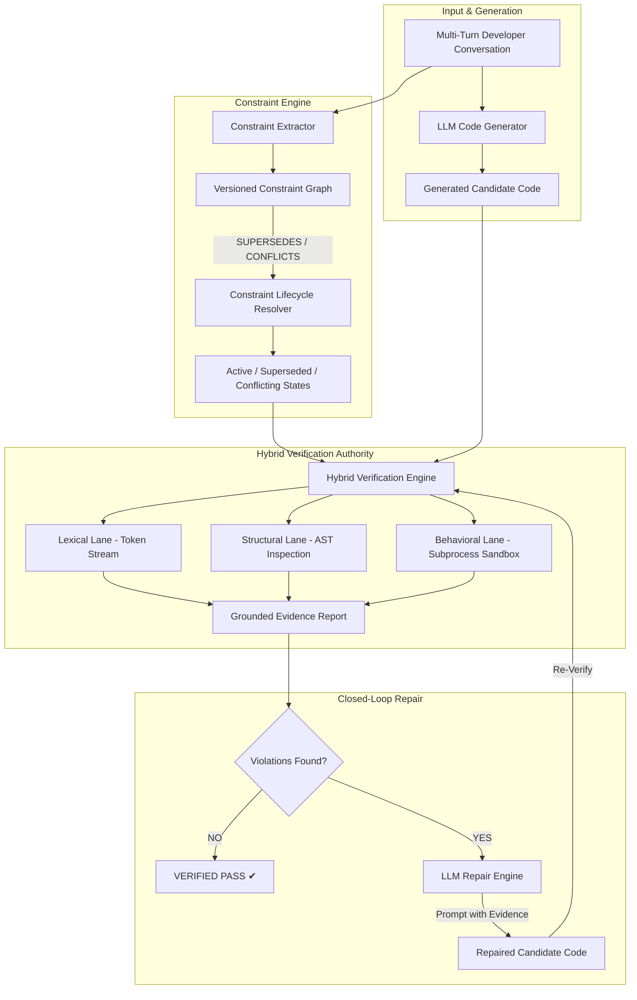

# 🛡️ ConstraintGuard

> **Model-Agnostic Verification & Grounded Closed-Loop Repair Layer for AI-Generated Code**


---

## 💡 The Problem: Multi-Turn LLM Drift

In multi-turn developer conversations with LLMs, user requirements evolve dynamically across turns. Standard LLMs frequently suffer from **context drift, constraint hallucination, and failure to handle requirement supersession**:
* **Ignored Exclusions**: The user requests a function in Turn 1, then adds *"Do not use built-in max()"* in Turn 2. The LLM ignores Turn 2 or keeps returning `max()`.
* **Obsolete Rules**: The user says *"Use recursion for factorial"* in Turn 1, then *"Don't use recursion, write an iterative solution instead"* in Turn 2. The LLM gets confused trying to satisfy both contradictory instructions.
* **Self-Verification Flaws**: Standard code evaluators rely on flat AST checks or ask the LLM to self-verify. LLMs cannot reliably self-verify code they generated incorrectly.

---

## 🚀 The ConstraintGuard Solution

**ConstraintGuard** introduces a **Track → Resolve → Verify → Repair** architecture that enforces requirement compliance with **Independent Verifier Authority**:

1. 🕸️ **Track**: Parses raw multi-turn conversation turns to extract constraints and models temporal relationships inside a **Versioned Constraint Graph (VCG)** using NetworkX.
2. ⚖️ **Resolve**: Graph traversal algorithms isolate active requirements, automatically supersede obsolete constraints, and detect contradictions.
3. 🛡️ **Verify**: Routes active constraints through a **3-Lane Hybrid Engine**:
   - **Lexical Lane**: Raw token stream scanning to catch hidden forbidden built-in usage.
   - **Structural Lane**: AST tree inspection for recursion, structures, decorators, and signature matching.
   - **Behavioral Lane**: Isolated subprocess sandbox execution with edge-case inputs (e.g. `[]`).
4. 🔧 **Grounded Repair (Key Innovation)**: Extracts line-numbered evidence from violations and feeds it to the LLM to propose candidate repairs. **ConstraintGuard re-verifies candidates independently** before accepting the fix.

---

## ⚡ Quick Start: 60-Second Demo

ConstraintGuard runs **100% locally out-of-the-box in Offline Deterministic Mode** with **zero setup or API keys required!**

### 1. Installation
```bash
git clone https://github.com/your-username/ConstraintGuard.git
cd ConstraintGuard
pip install -r requirements.txt
```

### 2. Launch Interactive Streamlit IDE Dashboard 💻
```bash
streamlit run app.py
```
*Open http://localhost:8501 in your browser to experience the full dark-mode IDE interface!*

### 3. Run Interactive Terminal Demo 🧪
```bash
python scripts/demo.py
```

### 4. Run Automated Test Suite (348 Tests) ⚙️
```bash
python -m pytest -v
```

### 5. Run Offline Reproducible Repair Benchmark 📊
```bash
python evaluation/run_repair_evaluation.py
```

---

## 📊 Baseline vs. ConstraintGuard Comparison

| Feature / Dimension | Flat AST Baseline | ConstraintGuard System |
| :--- | :--- | :--- |
| **Constraint State Model** | Flat List | **Versioned Constraint Graph (NetworkX DiGraph)** |
| **Edge Relationships** | None | **`SUPERSEDES`, `CONFLICTS`, `REINFORCES`, `DEPENDS_ON`** |
| **Verification Engine** | Flat AST check | **3-Lane Hybrid (Lexical + Structural AST + Subprocess Behavioral)** |
| **Evidence Grounding** | Boolean Pass/Fail | **Line-numbered evidence, AST nodes, and execution traces** |
| **Repair Capability** | None (Static failure) | **Closed-Loop LLM Repair (Independent Verifier Loop)** |
| **Offline Mode** | No | **100% Reproducible Offline Deterministic Mock Mode** |

---

## 🏗️ System Architecture



> [!IMPORTANT]
> **Independent Verifier Guarantee**: ConstraintGuard never trusts the LLM to self-verify. The LLM only proposes candidate repair code, while ConstraintGuard maintains sole independent verification authority.

---

## 📈 Benchmark & Measured Results

ConstraintGuard was evaluated on two standardized benchmark sets:

### A. Core Verification Benchmark (`ConstraintBench-Small`)
* **ConstraintGuard Accuracy**: **100.0%** (18/18 cases)
* **Baseline (Flat AST-Only) Accuracy**: **94.4%** (17/18 cases)
* **Violation Detection Recall**: **100.0%** (CG) vs **85.7%** (Baseline)

### B. Closed-Loop Repair Benchmark (`ConstraintBench-Repair`)
* **Initial Violation Rate**: **100.0%** (5/5 initial failure scenarios)
* **Repair Success Rate**: **100.0%** (5/5 resolved to `VERIFIED`)
* **Residual Violation Rate**: **0.0%** (0 unresolved failures)
* **Average Repair Iterations**: **1.00**
* **Constraint Preservation Rate**: **100.0%** (No regression on previously satisfied constraints)

---

## 💻 Streamlit IDE Interface Highlights

Launch `streamlit run app.py` to explore:
* 💬 **Multi-Turn Self-Input & Quick Scenarios**: Test custom prompt turns or click presets (e.g. *Built-in max() Prohibition*, *Recursion Supersession*, *ValueError Conflicts*).
* 🕸️ **Live Constraint Graph Inspector**: View active, superseded, and conflicting constraint pills alongside graph dependency edges.
* 🛡️ **Grounded Evidence Table**: Inspect detailed evidence badges, line numbers, and verifier lane outputs.
* 🔧 **Before & After Repair Code Diff**: Compare original non-compliant code directly against repaired Python source code side-by-side.

---

## ⚙️ Environment Setup (Optional Live LLM Integration)

ConstraintGuard works out-of-the-box in **Offline Demo Mode**. To connect live LLM providers (e.g. Groq Cloud or OpenAI), configure a `.env` file in the project root:

```env
LLM_BASE_URL=https://api.groq.com/openai/v1
LLM_API_KEY=your_groq_or_openai_api_key_here
LLM_MODEL=llama-3.3-70b-versatile
```

---

## 📂 Repository Structure

```
Project/
├── app.py                         # Streamlit Interactive Web IDE Dashboard
├── constraint_guard/              # Core ConstraintGuard Engine Package
│   ├── extractor.py               # Constraint Extractor (Pattern / Regex)
│   ├── graph.py                   # Versioned Constraint Graph (NetworkX DiGraph)
│   ├── resolver.py                # Constraint Lifecycle Resolver
│   ├── models.py                  # Pydantic Schemas & Data Structures
│   ├── llm/                       # Provider Abstraction & Parser
│   │   ├── provider.py            # Groq / OpenAI / Mock Providers
│   │   ├── prompts.py             # System & User Prompt Engineering
│   │   ├── parser.py              # AST-Validated Code Extractor & Sanitizer
│   │   └── service.py             # High-Level Code Generation Service
│   ├── verifier/                  # 3-Lane Hybrid Verification Engine
│   │   ├── lexical.py             # Lexical Token Verifier
│   │   ├── structural.py          # AST Structural Verifier
│   │   ├── behavioral.py          # Subprocess Sandbox Verifier
│   │   └── engine.py              # Verification Aggregator Engine
│   └── repair/                    # Closed-Loop Repair Layer
│       ├── repairer.py            # Evidence Prompting & Candidate Repairer
│       └── loop.py                # Repair Loop Controller & RepairHistory
├── evaluation/                    # Reproducible Evaluation Suite
│   ├── run_repair_evaluation.py   # Closed-Loop Repair Benchmark Runner
│   ├── repair_results.md          # Generated Repair Benchmark Report
│   └── repair_cases.py            # Benchmark Scenarios
├── scripts/                       # Demo Scripts & Evaluation Utilities
│   └── demo.py                    # Terminal Interactive Demo
└── tests/                         # Pytest Suite (348 Unit & Integration Tests)
```

---

## 🛡️ Technical Roadmap & Future Work

* **Containerized Execution**: Upgrade behavioral subprocess sandboxing to Docker/gVisor runtime isolation.
* **Complex Signature Expansion**: Extend automated behavioral testing to arbitrary multi-argument & class method signatures.
* **Dynamic Complexity Profiling**: Integrate empirical runtime profiling to estimate static asymptotic bounds (e.g., $O(N)$ vs $O(N^2)$).

---

<div align="center">
  <sub>Built for Safer, Verifiable, and Grounded AI Code Generation</sub>
</div>
