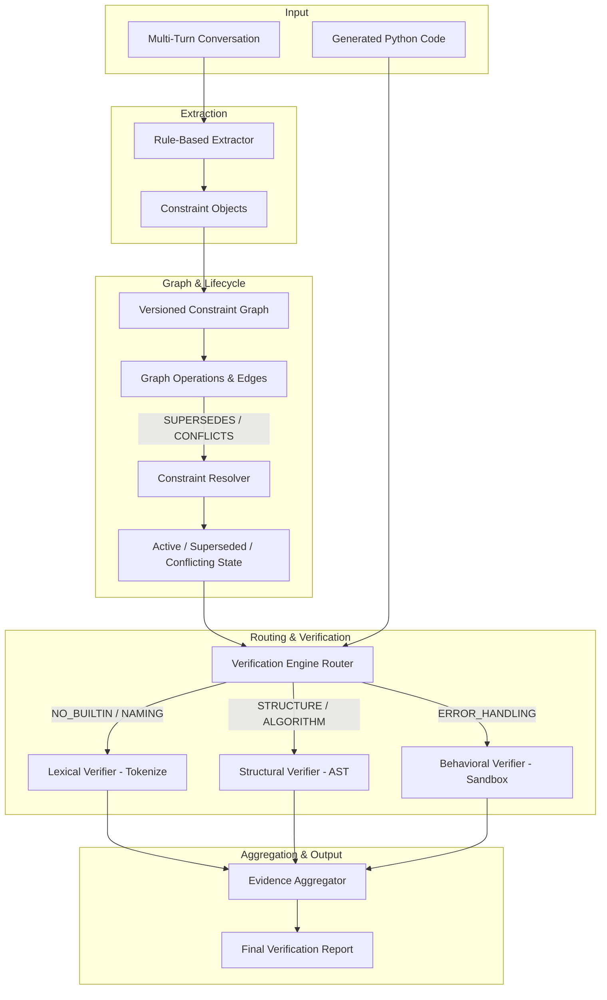

# ConstraintGuard System Architecture

## Overview
ConstraintGuard is a model-agnostic verification layer designed for multi-turn AI Python code generation. It tracks, resolves, and verifies constraints across evolving conversations.

## System Components

### 1. Constraint Extractor (`constraint_guard/extractor.py`)
Parses raw conversation turns using rule-based pattern matching and regular expressions to identify explicit constraints (`NO_BUILTIN`, `ALGORITHM`, `SIGNATURE`, `STRUCTURE`, `ERROR_HANDLING`, `NAMING`, `COMPLEXITY`, `GENERAL`).

### 2. Versioned Constraint Graph (`constraint_guard/graph.py`)
Maintains a NetworkX directed graph where nodes represent individual constraints and directed edges model relationships:
- `SUPERSEDES`: Later turn constraint overrides earlier turn constraint of the same target/type.
- `CONFLICTS`: Contradictory instructions in separate turns (e.g. `return None` vs `raise ValueError`).
- `REINFORCES`: Explicit continuation phrases ("keep previous restrictions").
- `DEPENDS_ON`: Structural prerequisites.

### 3. Lifecycle Resolver (`constraint_guard/resolver.py`)
Traverses the constraint graph to resolve state transitions:
- Traverses `SUPERSEDES` edges to mark ancestor constraints as `SUPERSEDES`.
- Identifies `CONFLICTS` cliques and marks all participating constraints as `CONFLICTING`.
- Yields the resolved active constraint set for downstream verification.

### 4. Hybrid Verification Engine (`constraint_guard/verifier/`)
Routes each active constraint to one or more applicable verification lanes:
- **Lexical Verifier** (`lexical.py`): Scans raw Python token streams to verify forbidden identifiers without AST masking.
- **Structural Verifier** (`structural.py`): Inspects AST tree nodes for recursion, loop structures, class definitions, and function name matches.
- **Behavioral Verifier** (`behavioral.py`): Executes code inside a separate Python subprocess with test fixtures (e.g. `[]`) to verify runtime behavior and exception handling.

### 5. Evidence Aggregator (`engine.py`)
Combines evidence strings and line numbers from all verification lanes into a unified verdict per constraint and produces an overall status (`VERIFIED`, `NOT_VERIFIED`, or `UNRESOLVED_CONFLICT`).
