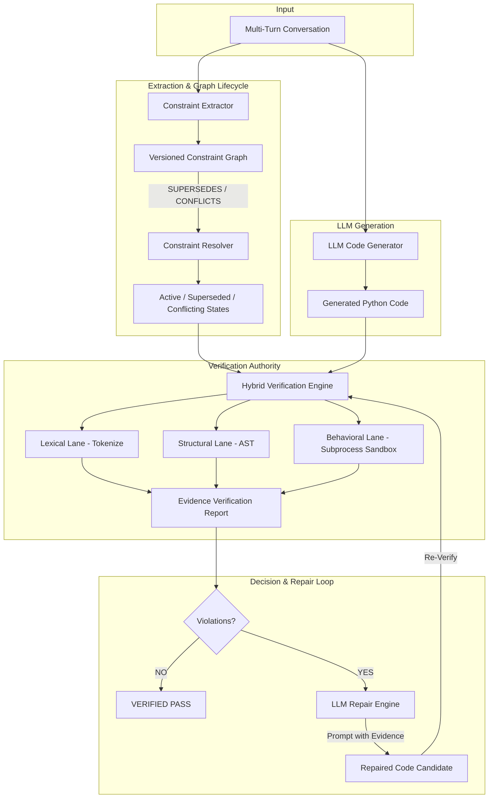

# ConstraintGuard System Architecture

## Overview
ConstraintGuard is a model-agnostic verification and repair layer designed for multi-turn AI Python code generation. It tracks, resolves, verifies, and repairs constraints across evolving conversations.



## System Components

### 1. LLM Provider & Generation Layer (`constraint_guard/llm/`)
- **Provider Abstraction** (`base.py`, `provider.py`): OpenAI-compatible HTTP client supporting environment variables (`LLM_BASE_URL`, `LLM_API_KEY`, `LLM_MODEL`). Provides fallback and deterministic mock providers for offline testing.
- **Parser** (`parser.py`): Robustly extracts code from Markdown ```python blocks and plain text.
- **Code Generator** (`service.py`): Formats multi-turn dialogs into LLM prompts.

### 2. Constraint Extractor (`constraint_guard/extractor.py`)
Parses raw conversation turns using rule-based pattern matching and regular expressions to identify explicit constraints (`NO_BUILTIN`, `ALGORITHM`, `SIGNATURE`, `STRUCTURE`, `ERROR_HANDLING`, `NAMING`, `COMPLEXITY`, `GENERAL`).

### 3. Versioned Constraint Graph (`constraint_guard/graph.py`)
Maintains a NetworkX directed graph where nodes represent individual constraints and directed edges model relationships:
- `SUPERSEDES`: Later turn constraint overrides earlier turn constraint of the same target/type.
- `CONFLICTS`: Contradictory instructions in separate turns (e.g. `return None` vs `raise ValueError`).
- `REINFORCES`: Explicit continuation phrases ("keep previous restrictions").
- `DEPENDS_ON`: Structural prerequisites.

### 4. Lifecycle Resolver (`constraint_guard/resolver.py`)
Traverses the constraint graph to resolve state transitions:
- Traverses `SUPERSEDES` edges to mark ancestor constraints as `SUPERSEDES`.
- Identifies `CONFLICTS` cliques and marks all participating constraints as `CONFLICTING`.
- Yields the resolved active constraint set for downstream verification.

### 5. Hybrid Verification Engine (`constraint_guard/verifier/`)
Routes each active constraint to one or more applicable verification lanes:
- **Lexical Verifier** (`lexical.py`): Scans raw Python token streams to verify forbidden identifiers without AST masking.
- **Structural Verifier** (`structural.py`): Inspects AST tree nodes for recursion, loop structures, class definitions, and function name matches.
- **Behavioral Verifier** (`behavioral.py`): Executes code inside an isolated Python subprocess sandbox with test fixtures (e.g. `[]`) to verify runtime behavior.

### 6. Evidence Aggregator (`engine.py`)
Combines evidence strings and line numbers from all verification lanes into a unified verdict per constraint and produces an overall status (`PASS` or `FAIL`).

### 7. Closed-Loop Repair Engine (`constraint_guard/repair/`)
- **Repairer** (`repairer.py`): Formats active constraints, current code, line-numbered evidence, and instructions for the LLM.
- **Repair Controller & History** (`loop.py`): Executes controlled iteration loops (max 2 attempts) and returns structured `RepairHistory` objects.
- **Strict Verification Separation**: ConstraintGuard remains the sole independent verifier. The LLM only proposes candidate repairs.
